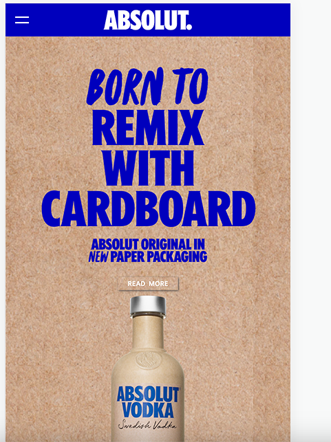
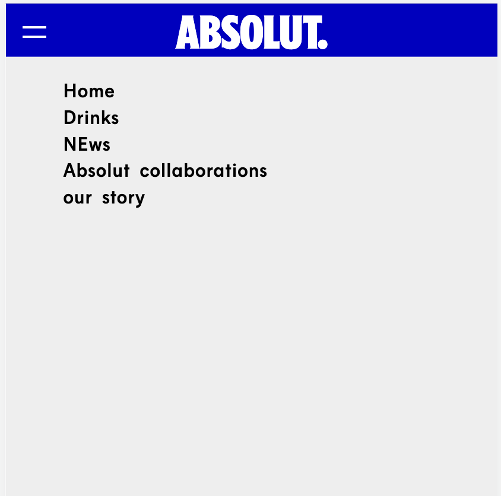
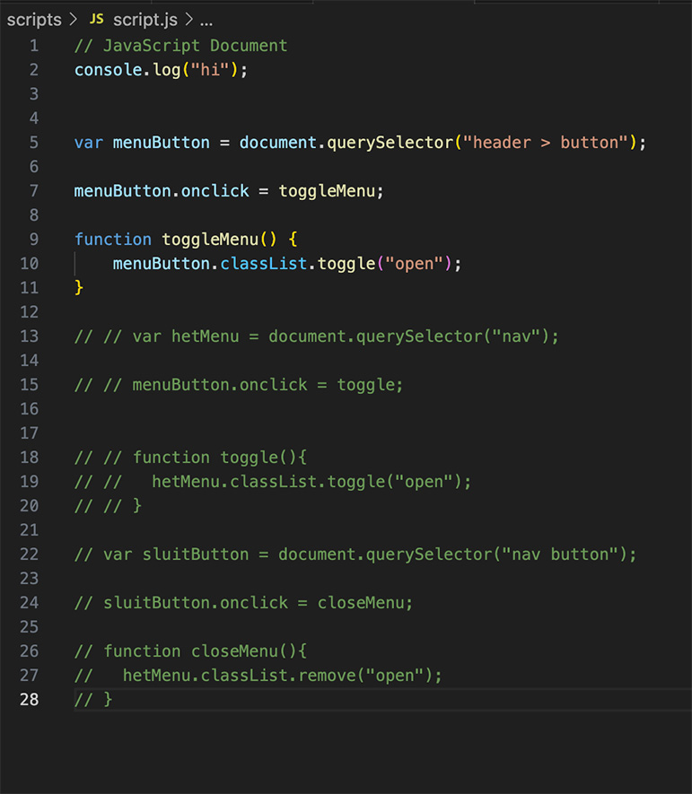
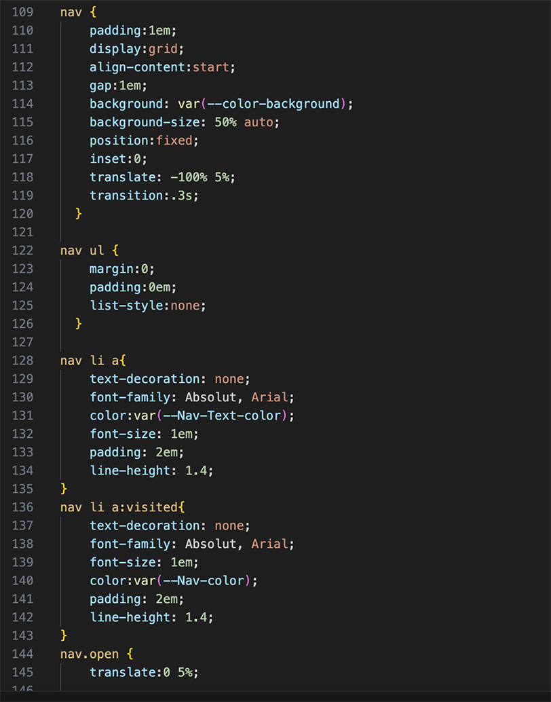
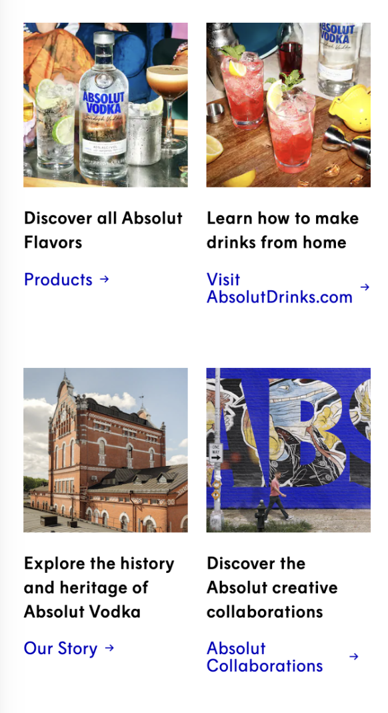
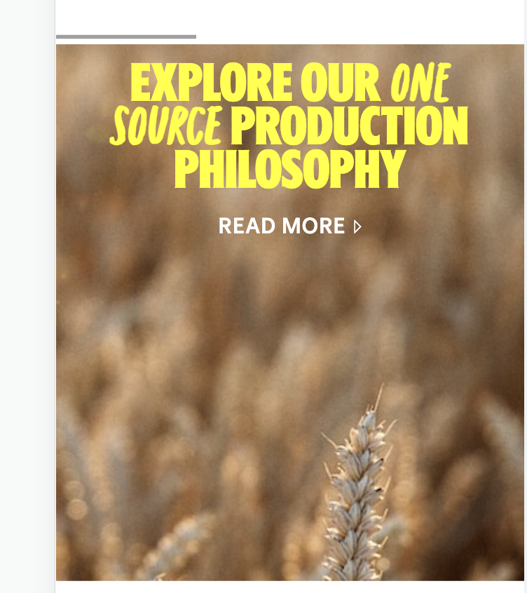

# Procesverslag
Markdown is een simpele manier om HTML te schrijven.  
Markdown cheat cheet: [Hulp bij het schrijven van Markdown](https://github.com/adam-p/markdown-here/wiki/Markdown-Cheatsheet).

Nb. De standaardstructuur en de spartaanse opmaak van de README.md zijn helemaal prima. Het gaat om de inhoud van je procesverslag. Besteedt de tijd voor pracht en praal aan je website.

Nb. Door *open* toe te voegen aan een *details* element kun je deze standaard open zetten. Fijn om dat steeds voor de relevante stuk(ken) te doen.

## Jij

  
uitwerken voor kick-off werkgroep

  ### Auteur:
  Annika Mekkelholt

  #### Je startniveau:
  mijn startniveau is blauwe/rood piste
  
  #### Je focus:
  MIjn focus ligt nu op responsive 
 

## Je website

  
uitwerken voor kick-off werkgroep

  ### Je opdracht:
  link naar de website die je gaat namaken óf de naam/omschrijving van je eigen ontwerp
  https://www.absolut.com/en/campaign/paper-bottle/

  #### Screenshot(s) van de eerste pagina (small screen): 
  hier de naam van de pagina  
  

  #### Screenshot(s) van de tweede pagina (small screen):
  hier de naam van de pagina  
  
 

## Toegankelijkheidstest 1/2 (week 1)

  
uitwerken na test in 2e werkgroep

  ### Bevindingen
  Lijst met je bevindingen die in de test naar voren kwamen:
  
  Aan het begin zegt de screenreader 'Heading 4' en dan 'choose your region' en leest hij alle talen voor waardoor 
  je heel verward raakt.

IDe links worden niet goed uitgelegd en wat ik zie, is niet wat ik hoor, zoals de plaatjes die naar de volgende pagina gaan zijn niet te lezen en heel onduidelijk(mensen met en zonder screenreader)
Foto is het gehele link, niet alleen de button op de foto. 

Gaat eerst naar de talen, dan de navigatie balk, dan naar absoluut drankjes die ik niet zie staan dan naar de titel en dan naar de foto die je als eerste ziet om naar de volgende pagina te gaan. 

De WCAG checklist ook ingevuld, en het is behoorlijk slecht gegaan. Bijna bij elk puntje in er wel wat aan de hand. Vooral over de indeling en de niet semantieke HTML. 

De header van ABSOLUT. is een  foto als ik het goed zie en is niet geheel 1 kleur, dus moet kijken hoe ik dat ga doen en als het font niet gaat werken wat ik wel ga doen. 

Ik heb problemen met het ABSOLUT. font, want het lijkt niet te werken, dus moet kijken of het aan mij ligt of aan iets anders ligt. ik hoop aan mezelf en het kan fixen en anders moet ik er iets anders op vinden. Tot nu toe denk ik dat IMPACT het beste past bij de headers en ook nog een ander font, maar die moet ik nog een beetje uitvinden. 

## Breakdownschets (week 1)

  
uitwerken na afloop 3e werkgroep

  ### de hele pagina: 
  

  ### dynamisch deel (bijv menu): 
  

  ### wellicht nog een dynamisch deel (bijv filter): 
  

## Voortgang 1 (week 2)

  
uitwerken voor 1e voortgang

  ### Stand van zaken

  Ik kreeg te horen dat ik de plaatjes opnieuw moet maken met tekst en button etc, dus ben nog gebleven bij het eerste stuk. 
  <!-- hier dit ging goed & dit was lastig (neem ook screenshots op van delen van je website en code) -->
 Ik heb vooral gewerkt om het eerste plaatje in orde te krijgen en de navigatie(hamburger menu) goed te doen. maar dat gaat redelijk. Met de hamburger menu kreeg ik eerst wel een kruisje, maar moest toen nog de navigatie toe voegen en toen ging het mis. Het lukt me niet om nav maar een deel van het scherm te krijgen en dat het kruisje te voorschijn komt. Daarnaast heb ik nu dat hij 5% is gezakt anders kan ie ook niet meer dichtklappen. Ook heb ik moeite met de spacing tussen de li elementen, maar daar ga ik pas later echt opzoek. 

 Wat betreft het plaatje. Het lukt me niet om 1 woord te veranderen in de zin, want internet zegt dat het niet kan en zelf weet ik het ook niet. Ik heb nu spans gebruikt, maar vraag het wel een keer in de les of er een andere manier is. Ook weet ik niet hoe ik het ene plaatje aan de rechter kant krijg naar de button en de h2. De tekst is me wel gelukt en de button ook- het blijft niet perfect, maar ik heb geen idee wat zij hebben gedaan. 

 -----Na de de meeting van het groepje dat we de vragen gingen opstellen, kreeg ik al het antwoord voor mijn vraag over 1 woord veranderen in de zin. Dus ik heb een probleem minder en kan weer verder.

 
 
 

  ### Agenda voor meeting
  samen met je groepje opstellen

  | Karlijn  :
   Wanneer afbeelding in html en wanneer is CSS?
   Hoe plaats ik een foto op de goede plek in verband met grid?
  
  
  | Joost:
    mag een <h2> in een <a>?
    wanneer svg en wanneer een button?
    Mag een <ul> in een <ul>?
    wat zijn handige volgordes van   
 <h2> enz.?
   
  |Annika:
    Hoe werkt de nav samen met de button in het hamburger menu?
    Hoe plaats ik een foto op de goede plek in verband met grid?
  

  | Tygo:
    hoe zorg ik ervoor dat ( checkbox ) filters zich daadwerkelijk toepassen op de artikelen die de website mij zal tonen?

  

  ### Verslag van meeting
  hier na afloop snel de uitkomsten van de meeting vastleggen

  - punt 1
  - punt 2
  - nog een punt
  - ...

## Voortgang 2 (week 3)

  
uitwerken voor 2e voortgang

  ### Stand van zaken
  <!-- hier dit ging goed & dit was lastig (neem ook screenshots op van delen van je website en code) -->
  Ik loop altijd wel bij een section vast, zoals bij de eerste section de tekst en het plaatje niet goed op de plaats kunnen zetten, en bij de tweede ging het eig wel goed, maar wist ik niet of er nog een button bij moest en of ik het zo mocht doen(plus is dat hele plaatje random verdwenen op de normale site...)
  de derde section was ik op eens 2 van de 6 items kwijt en moest ik goed spelen hoe groot de rows,en columns waren plus nog kijken of het werkte met de h2 erboven. 
  in de 4de section had ik ook problemen met de tekst omdat de element strong dan niet meer stelde en zag ie de span niet. 

  Maar in de les had ik alles gebraagd en ben ik verder gekomen, en was het vooral een beetje kopieren en plakken en dan daarvan uit alles aan passen omdat het wel beetje op elkaar lijkt. 
  bij de 5de section zijn de plaatjes niet allemaal even groot dus daar had ik ook moeite mee, maar heb ze nu gewoon de zelfde height gegeven(net zoals bij de 3de section met de caption)

  NU mijn grootste problemen zijn: dat ik bij de 4e section, mijn plaatje niet goed krijg. Ik weet niet hoe ik hem op 100% kan krijgen, ik krijg nu een klein gedeelte te zien. 

  Ik heb eigenlijk daarna geen problemen meer gekregen, en ben ik bijna klaar met alle concent. De footer vind ik wel nog steeds lastig hoe ik die moet maken en de navigatie ook.
  maar naast het plaatje heb ik geen problemen.

  
  

  ### Agenda voor meeting
  samen met je groepje opstellen
 
 annika: 
 hoe kan ik mijn details/summary stijlen dat het plusje aan de andere kant staat?  hoe krijg ik mijn img geheel te zien? en mag ik los een img er in zetten?

joost: geen vragen
karlijn: geen vragen
tygo: heb ik goed gebruik gemaakt van sections, ul en li in mijn html?

hoe spreek ik elementen aan die diep genesteld zijn (in een li in een ul in een section in de main bijv)

is het nodig voor mij om img elementen in een a te zetten wanneer ze op mijn nepsite niet zullen functioneren als een a?

hoe kan ik het beste stap voor stap verder met mijn css? waar moet ik beginnen?

  ### Verslag van meeting
  hier na afloop snel de uitkomsten van de meeting vastleggen

   kreeg goede feedback bij het voortgang gesprek, want mocht geen section gebruiken zonder h er bij, dus ie moest ik verwijderen of veranderen naar een div. 

   en over de background img goed gepositioneerd. 

## Toegankelijkheidstest 2/2 (week 4)

  
uitwerken na test in 9e werkgroep

  ### Bevindingen
  Lijst met je bevindingen die in de test naar voren kwamen (geef ook aan wat er verbeterd is):

    eigenlijk ben ik dus al grootendeels klaar met de content schrijven, maar moetn u nog animaties er in stoppen. Ik heb wel al kleine animaties toegevoegd maar dat is nog niet genoeg. 

    daarna heb ik dark mode en reduce motion toegevoegd dus ik moet nu nog 3 andere toevoegen tot het voldoende is. 

    heb ook op woensdag veel focus states en hover states toegevoegd. 

## Voortgang 3 (week 4)

  
uitwerken voor 3e voortgang

  ### Stand van zaken
  hier dit ging goed & dit was lastig (neem ook screenshots op van delen van je website en code)

  ### Agenda voor meeting
  samen met je groepje opstellen

  | student 1      | student 2          | student 3    | student 4        |
  | ---            | ---                | ---          | ---              |
  | dit bespreken  | en dit             | en ik dit    | en dan ik dat    |
  | en dat ook nog | dit als er tijd is | nog een punt | dit wil ik zeker |
  | ...            | ...                | ...          | ...              |

  ### Verslag van meeting
  hier na afloop snel de uitkomsten van de meeting vastleggen

  - punt 1
  - punt 2
  - nog een punt
  - ...

## Eindgesprek (week 5)

  
uitwerken voor eindgesprek

  ### Je uitkomst - karakteristiek screenshots:
  

  ### Dit ging goed/Heb ik geleerd: 
  Korte omschrijving met plaatjes

  

  ### Dit was lastig/Is niet gelukt:
  Korte omschrijving met plaatjes

  

## Bronnenlijst

  
continu bijhouden terwijl je werkt

  Nb. Wees specifiek ('css-tricks' als bron is bijv. niet specifiek genoeg). 
  Nb. ChatGpT en andere AI horen er ook bij.
  Nb. Vermeld de bronnen ook in je code.

  1. bron 1
  2. bron 2
  3. ...

